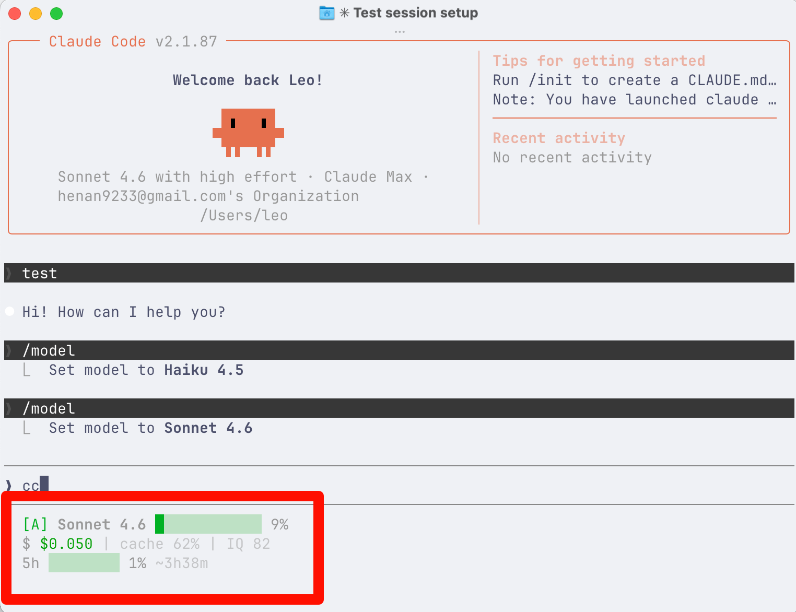

# TokenScore

**Make every token count.**

Real-time token consumption tracking, cost analysis, and three-dimensional scoring for AI coding tools.



## Statusline Preview

```
[S] Opus 4.6 (1M context) ██░░░░░░░░░░ 20%
  $ $3.83 | cache 100% | IQ 95
  5h █░░░░░░░ 7% ~3h44m
```

| Element | Meaning |
|---------|---------|
| `[S]` | Model tier badge (S/A/B/C/D) |
| `██░░░░░░░░░░ 20%` | Context window usage (green/yellow/red) |
| `$3.83` | Real-time session cost |
| `cache 100%` | Cache hit rate — higher = cheaper tokens |
| `IQ 95` | Model intelligence score (0-100) |
| `5h █░░░░░░░ 7%` | 5-hour rate limit usage with reset countdown |

## Features

- **Real-time Statusline** — See token costs, cache efficiency, and rate limits directly in your Claude Code terminal
- **Multi-tool Tracking** — Parses sessions from Claude Code and Codex CLI (with subagent support)
- **Accurate Cost Calculation** — Includes cache read/write pricing for precise cost estimates
- **3D Scoring System** — Rates sessions on Efficiency (40%) + Difficulty (35%) + Model Intelligence (25%)
- **CLI Dashboard** — Full command-line interface for scanning, scoring, and exporting data
- **Stats Integration** — Reads `stats-cache.json` for global usage analytics with activity heatmaps
- **Zero-build Install** — Plugin dist is pre-built, no compilation needed

## Quick Start

### As Claude Code Plugin (Recommended)

```bash
# Add the marketplace
/plugin marketplace add Die-Hu/tokenscore

# Install the plugin
/plugin install tokenscore

# Run setup (zero build, just configures statusline)
/tokenscore:setup
```

### As CLI Tool

```bash
# Install globally
npm install -g @tokenscore/cli

# Scan your AI tool usage
tokenscore scan

# View status
tokenscore status

# See project scores
tokenscore score

# View Claude Code global stats
tokenscore stats
```

## CLI Commands

| Command | Description |
|---------|-------------|
| `tokenscore scan` | Import sessions from Claude Code / Codex CLI |
| `tokenscore status` | Overview dashboard (projects, tokens, cost) |
| `tokenscore projects` | List all tracked projects with stats |
| `tokenscore project <path>` | Detailed view of a single project |
| `tokenscore score` | Three-dimensional scoring rankings |
| `tokenscore stats` | Global Claude Code stats from stats-cache.json |
| `tokenscore export` | Export to JSON or CSV |
| `tokenscore config` | View and manage configuration |

## Scoring System

TokenScore uses a three-dimensional scoring system:

### Efficiency (40%)
How well tokens were used relative to task complexity. Considers cache hit rates, token-per-prompt ratios, and effective cost.

### Difficulty (35%)
Estimated from session metrics: conversation depth, tool diversity, tool call density, session duration, token intensity, and subagent complexity.

### Model Intelligence (25%)
Based on model tier rankings (S/A/B/C/D) derived from coding benchmarks.

Grades: `S+ S A+ A A- B+ B B- C D F`

## Prerequisites

### Statusline Plugin Only (zero native deps)
- **Node.js 20+** — that's it! No C++ compiler needed.

### CLI Tool (requires native SQLite)
- **Node.js 20+**
- **macOS**: `xcode-select --install` (Xcode Command Line Tools)
- **Windows**: [Visual Studio Build Tools](https://visualstudio.microsoft.com/visual-cpp-build-tools/) with "Desktop development with C++" workload + Python 3
- **Linux**: `sudo apt install build-essential python3` (or equivalent)

> The CLI uses `better-sqlite3` which compiles native SQLite. Prebuilt binaries are available for most Node.js LTS versions. If prebuilds fail, it falls back to source compilation.

## Architecture

```
tokenscore/
  packages/
    core/     @tokenscore/core    — Parsing, scoring, pricing, database
    cli/      @tokenscore/cli     — Command-line interface
    plugin/   @tokenscore/plugin  — Claude Code statusline plugin (pre-built)
    web/      @tokenscore/web     — Web dashboard (planned)
```

**Tech stack:** TypeScript, pnpm monorepo, Turbo, SQLite + Drizzle, tsup

## Supported Tools

| Tool | Data Source | Token Accuracy |
|------|-----------|---------------|
| Claude Code | `~/.claude/projects/**/*.jsonl` + subagents | Exact (from API usage) |
| Codex CLI | `~/.codex/sessions/rollout-*.json` | Estimated (4 chars/token) |

## Pricing

TokenScore calculates costs using accurate per-model pricing including cache token tiers:

- **Input tokens** — Full rate
- **Output tokens** — Full rate
- **Cache read** — 10% of input rate
- **Cache creation** — 125% of input rate

Supports: Claude Opus/Sonnet/Haiku (4.6/4.5/4/3.x), GPT-4o, GPT-4.1, o3, o4-mini, Codex Mini

## License

MIT
